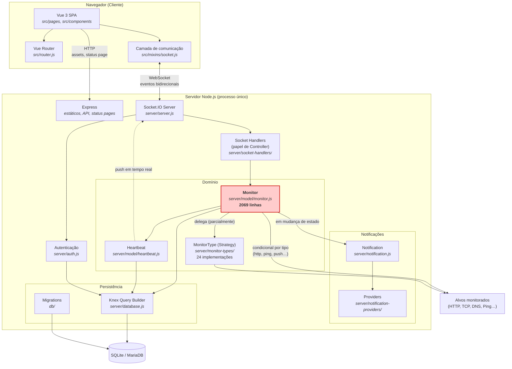
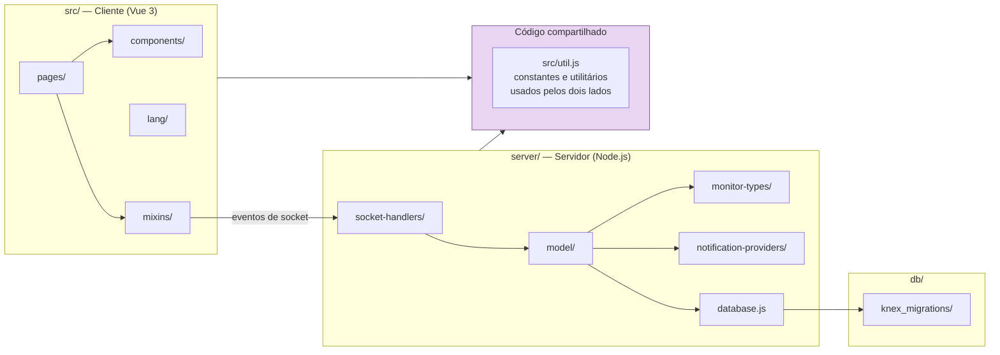

# Arquitetura do Uptime Kuma

> **CSI410 – Engenharia de Software II** — UFOP / ICEA / DECSI
> Professor: Igor Muzetti Pereira — Semestre 2026/1
> Trabalho prático: *Open Source engineering challenge*
>
> **Projeto analisado:** [Uptime Kuma](https://github.com/louislam/uptime-kuma)
> **Versão:** `2.4.0`
> **Commit base da análise:** `62a2d01d3f2eb6df47e1c987b7819bead6a91e2e` (13/07/2026)
> **Fork:** https://github.com/Vitwra/uptime-kuma
>
> **Dupla:** `<NOME 1>` e `<NOME 2>`

---

## 1. Visão geral do sistema

O Uptime Kuma é uma ferramenta *self-hosted* de monitoramento de disponibilidade (*uptime monitoring*). O usuário cadastra **monitores** — endpoints HTTP, portas TCP, pings ICMP, registros DNS, bancos de dados, filas de mensagem, entre outros — e o sistema executa verificações periódicas, registra o resultado de cada verificação (**heartbeat**), calcula métricas de disponibilidade e dispara **notificações** quando um serviço muda de estado.

Arquiteturalmente, é um **monólito cliente-servidor** composto por três partes:

| Parte | Tecnologia | Localização |
|---|---|---|
| Cliente (SPA) | Vue 3 + Vite | `src/` |
| Servidor | Node.js, Express, Socket.IO | `server/` |
| Persistência | Knex sobre SQLite (padrão) ou MariaDB/MySQL | `server/database.js`, `db/` |

O ponto mais característico do sistema — e o mais relevante para esta análise — é que **a comunicação principal entre cliente e servidor não é REST, e sim WebSocket** (Socket.IO). O HTTP é usado essencialmente para servir os arquivos estáticos, as *status pages* e algumas rotas de API. Toda a interação de gerenciamento (autenticação, CRUD de monitores, recebimento de heartbeats em tempo real) trafega por eventos de socket.

> **Nota sobre a versão.** A partir da versão 2.0.0 o projeto passou a oferecer MariaDB/MySQL como alternativa ao SQLite, que era o banco padrão até então. Nossa análise foi feita sobre o branch 2.x com SQLite, a configuração recomendada para instalações de pequena escala e a mais próxima do uso típico do produto.

---

## 2. Estilo arquitetural

Classificamos o sistema como uma **arquitetura em camadas (*layered*) sobre um monólito cliente-servidor, com comunicação orientada a eventos**.

É tentador rotulá-lo simplesmente de "MVC" — e o vocabulário do código sugere isso, já que existe uma pasta `server/model/`. Mas o rótulo seria impreciso, e essa imprecisão é justamente o achado interessante:

| Elemento do MVC clássico | Correspondente no Uptime Kuma | Divergência |
|---|---|---|
| **Model** | `server/model/` (`monitor.js`, `heartbeat.js`, `user.js`, …) | Segue o padrão **Active Record** — o objeto de domínio sabe se persistir e se serializar. Não há camada de repositório separada nem Model anêmico. |
| **View** | `src/` (páginas e componentes Vue) | Roda em **outro processo**, no navegador. Não é uma view renderizada pelo servidor. |
| **Controller** | `server/socket-handlers/` | Não são controllers HTTP mapeando rotas e verbos; são **handlers de eventos de socket**. O acoplamento se dá por nome de evento, não por URL. |

Ou seja: **a estrutura é MVC-*like*, mas o mecanismo de transporte é publish/subscribe.** O servidor não apenas responde a requisições — ele *empurra* estado para o cliente. É o padrão **Observer** aplicado na fronteira da rede.

### 2.1. Justificativa da escolha arquitetural

A decisão é coerente com o domínio e com o público-alvo do produto:

1. **O domínio é intrinsecamente *push*.** Um monitor produz heartbeats continuamente, de forma assíncrona, sem que o usuário solicite. Com REST puro, o dashboard precisaria de *polling* constante; com WebSocket, o servidor notifica apenas quando há mudança. Resultado: menos tráfego, menor latência e um dashboard efetivamente em tempo real.

2. **O alvo é *self-hosting* por não-especialistas.** Um monólito com SQLite embarcado significa um processo, um arquivo de banco e zero infraestrutura. É o motivo pelo qual a aplicação sobe com `npm install` seguido de um único comando — inclusive em Windows, sem Docker e sem WSL, o que verificamos na prática. Uma arquitetura de microsserviços seria tecnicamente defensável e praticamente inviável para esse público.

3. **Baixa carga por instância.** Uma instância típica monitora dezenas de endpoints para um único usuário ou equipe. Não existe requisito de escala horizontal que justifique separar serviços.

**Trade-off assumido:** o preço dessa simplicidade é o acoplamento. Como a ausência de fronteiras físicas entre módulos não impõe nenhuma disciplina, responsabilidades vazaram — e o servidor passou a concentrar bootstrap, autenticação, agendamento e regra de negócio em pouquíssimos arquivos, muito grandes. É o que documentamos na seção 5 e atacamos em `padroes_e_smells.md`.

---

## 3. Diagrama de componentes



> A classe `Monitor` está destacada em vermelho porque, como detalhamos na seção 5, ela concentra responsabilidades que deveriam estar distribuídas. Note que ela possui **dois caminhos de execução para a mesma finalidade**: delega a verificação à Strategy `MonitorType` para alguns tipos, mas executa a verificação diretamente, dentro de um condicional, para outros.

---

## 4. Diagrama de pacotes



O módulo compartilhado entre cliente e servidor é uma decisão deliberada para evitar duplicação de constantes — notadamente os códigos de status de um heartbeat — entre os dois processos. É uma solução pragmática, mas também um ponto de acoplamento: uma alteração ali afeta cliente e servidor simultaneamente.

---

## 5. Análise crítica da arquitetura

Três observações fundamentam as refatorações propostas em `padroes_e_smells.md`. Todas foram verificadas no commit base desta análise.

### 5.1. O núcleo do domínio é uma God Class

`server/model/monitor.js` possui **2069 linhas** e acumula: representação da entidade, agendamento do próprio ciclo de verificação, execução da checagem, avaliação de mudança de estado, disparo de notificações e persistência. Um único arquivo carrega o que deveria estar distribuído entre entidade, serviço de agendamento, estratégia de verificação e serviço de notificação. É a consequência direta do Active Record levado ao extremo em um monólito sem fronteiras internas.

### 5.2. A migração para Strategy foi iniciada pelos próprios mantenedores — e não concluída

Este é o achado central da nossa análise.

O diretório `server/monitor-types/` contém uma interface base (`monitor-type.js`) e **24 implementações** — `dns`, `mqtt`, `mongodb`, `postgres`, `redis`, `snmp`, `steam`, `rabbitmq`, `tcp`, `grpc`, `smtp`, entre outras. Ou seja: **o projeto já reconheceu que o condicional por tipo de monitor era um problema e adotou o padrão Strategy para resolvê-lo.**

Entretanto, os tipos de monitor **mais utilizados do produto continuam fora da Strategy**: `http`, `keyword`, `json-query`, `ping`, `push`, `docker`, `radius` e `kafka-producer` permanecem tratados dentro de uma cadeia condicional em `monitor.js`, aproximadamente entre as linhas **440 e 925** — cerca de **500 linhas de `if / else if`** dentro de um único método.

O padrão da migração é revelador: extraiu-se para a Strategy tudo o que era **periférico**, e deixou-se no condicional justamente o **caminho quente** do sistema. A refatoração parou no meio.

A degradação já é visível. A linha 925 contém:

```js
} else if (this.type === "json-query" && this.retry_only_on_status_code_failure) {
```

A condição deixou de ser apenas "qual é o tipo do monitor" e passou a **misturar tipo com regra de negócio de retry**. É assim que um condicional degenera: cada nova funcionalidade acrescenta mais uma cláusula, e o comportamento por tipo deixa de ser isolável. Na prática, o **Princípio Aberto/Fechado (OCP)** é violado a cada nova feature — não é possível estender o comportamento sem modificar `monitor.js`.

**Consequência para este trabalho:** completar essa migração é uma refatoração de impacto arquitetural real, alinhada à direção que o próprio projeto já adotou. Não estamos impondo um padrão externo ao código — estamos concluindo um trabalho que os mantenedores começaram e que a interface `MonitorType` já suporta.

### 5.3. O acoplamento por nome de evento é frágil

Como o contrato entre cliente e servidor é uma *string* de evento de socket, e não uma rota tipada, não há verificação estática que impeça o cliente de emitir um evento que o servidor não escuta — ou o contrário. Isso transfere a garantia de correção do compilador para os testes, o que reforça a necessidade dos testes de aceitação automatizados descritos em `testes_devops.md`.

---

## 6. Como reproduzir a análise

```bash
git clone https://github.com/Vitwra/uptime-kuma.git
cd uptime-kuma
npm install
npm run dev
# Acesse http://localhost:3000
```

**Requisitos:** Node.js `>= 20.4.0` (campo `engines` do `package.json`) e Git. **Não é necessário Docker nem WSL** — a aplicação roda nativamente em Windows, Linux e macOS, o que verificamos em ambiente Windows com Node 22.14.0.

Para reproduzir as métricas citadas na seção 5:

```powershell
# Tamanho da God Class
(Get-Content server\model\monitor.js).Count

# O condicional por tipo de monitor
Select-String -Path server\model\monitor.js -Pattern 'this\.type ===' | Select-Object LineNumber, Line

# Os tipos já migrados para a Strategy
dir server\monitor-types
```
